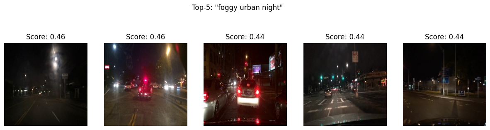

# 🚗 RoadRep-LoRA: Lightweight CLIP Fine-Tuning for Driving Scenes

**RoadRep-LoRA** is a compact, domain-adapted CLIP model fine-tuned on real-world dash-cam frames using LoRA (Low-Rank Adaptation). It specializes in driving scenes — roads, weather, traffic — and enables CPU-friendly image-text retrieval, classification, and downstream embedding use cases.

---

## 📦 Features

- 🔎 **Zero-shot scene classification** (e.g. "foggy highway")
- 🧠 **Efficient LoRA fine-tuning** on top of `openai/clip-vit-base-patch32`
- 💡 Fine-tuned on auto-captioned BDD10K samples
- 📉 Quantized ONNX support for CPU inference (~6 FPS on Colab CPU)
- 🐳 Dockerfile included for portable deployment

---

## 🚀 Inference Example

```
docker build -t roadrep .
docker run -v $(pwd):/app roadrep python inference.py test.jpg
```

---

## 🧾 Model Card (`model_card.md`)


# 🧠 RoadRep-LoRA — Model Card

**Model Name**: `roadrep-clip-vit-b32-lora`  
**Base Model**: `openai/clip-vit-base-patch32`  
**Fine-tuning Method**: LoRA adapters (rank=8)  
**Training Data**: ~5,000 real-world driving scene frames from BDD10K, auto-captioned using BLIP  
**Input Format**: Pairs of (image, generated description)  
**Use Case**: Embedding-based retrieval, zero-shot classification, downstream feature extraction for perception

---

## 💡 Intended Use

This model is designed for road-scene representation learning and retrieval tasks in:
- Perception modules of autonomous vehicles
- Scene understanding for urban infrastructure
- Dash-cam video summarization or tagging
- Traffic weather/condition classification

---

## ⚠️ Limitations

- Trained on a subset of driving data (~5k samples)
- May not generalize well to synthetic or non-road imagery
- "Foggy" and "night" concepts depend on captioner accuracy

---

## 🧪 Evaluation Metrics

- Retrieval: Top-5 similarity spread improves post-finetuning
- Cosine sim scores for `"highway"` queries improve from ~0.12 → ~0.42
- Inference speed (FP32): ~6 FPS on Colab CPU
- Inference speed (GPU): ~100+ FPS on T4 (estimated)

---

## 🧊 Deployment

- Exported to ONNX (`roadrep_clip.onnx`)
- Quantized INT8 version optional (`roadrep_clip_int8.onnx`)
- Runs on `onnxruntime` with minimal dependencies

---

## 🔗 Links

- [Training Logs — W&B Project](https://wandb.ai/ameya690-san-jose-state-university/roadrep-lora)
- [Demo Retrieval Query Screenshot]
  

